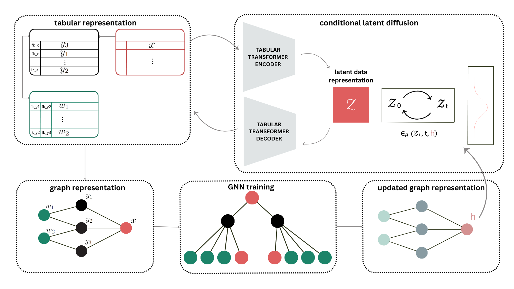

Relational Data Generation with Graph Neural Networks and Latent Diffusion Models
==============================
This repository contains the code for the paper "Relational Data Generation with Graph Neural Networks and Latent Diffusion Models" 


This project presents a novel method for synthetic relational data generation that uses a graph representation of a relational database. We combine the expressive power of graph neural networks and generative capabilities of latent diffusion models to achieve state-of-the-art performance with respect to multi-table fidelity on the [SyntheRela](https://github.com/martinjurkovic/syntherela) benchmark.

<p align="center">
  
</p>


 

Installation
------------
Create environment and install requirements
```bash
conda create -n relgdiff python=3.10
conda activate relgdiff
pip install -r requirements.txt
```

Example
------------
Download the datasets from the SyntheRela benchmark [here](https://drive.google.com/drive/u/2/folders/1L9KarR20JqzU0p8b3G_KU--h2b8sz6ky).

Preprocess data
```bash
python src/scripts/preprocess_data.py --dataset-name DATASET_NAME
```
Training
```bash
python src/scripts/train.py --dataset-name DATASET_NAME
```
Sampling
```bash
python src/scripts/sample.py --dataset-name DATASET_NAME 
```

## Citing
```
@inproceedings{
  hudovernik2024relational,
  title={Relational Data Generation with Graph Neural Networks and Latent Diffusion Models},
  author={Valter Hudovernik},
  booktitle={NeurIPS 2024 Third Table Representation Learning Workshop},
  year={2024},
  url={https://openreview.net/forum?id=MNLR2NYN2Z}
}
```
